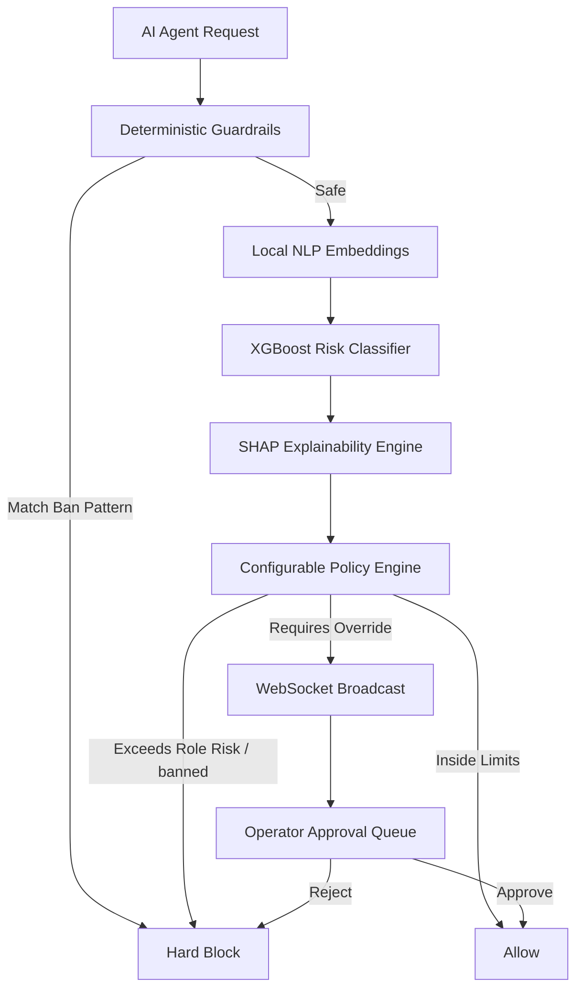

# AURA Firewall: Autonomous AI Agent Safety & Permission Control System

AURA (Autonomous Risk & Authorization) is a local, high-speed security middleware firewall that intercepts autonomous AI agent actions, evaluates risk using local ML, enforces declarative authorization policies, logs audits to a persistent store, and routes suspect actions to a React dashboard for human approval in real-time.

---

## 🚀 One-Command Startup

Start the entire stack (PostgreSQL, Redis, FastAPI Backend, React Frontend, and Traffic Seeding Generator) using Docker Compose:

```bash
docker compose up --build
```

*   **React Dashboard**: `http://localhost:5173`
*   **FastAPI Swagger UI**: `http://localhost:8000/docs`
*   **WebSockets Channel**: `ws://localhost:8000/api/v1/ws/approvals`
*   **OpenAPI 3.0 Contract**: [openapi.yaml](./openapi.yaml) (located at the root directory)

---

## 🛡️ Multi-Layered Safety Pipeline

AURA evaluates requests through a secure pipeline:



1.  **Deterministic Guardrails (Pre-Filter)**: Scans incoming action parameters using regular expressions to instantly block catastrophic patterns (e.g. `rm -rf`, `DROP TABLE`, `/etc/passwd`) before downstream operations.
2.  **Local Machine Learning Engine (XGBoost + SHAP)**:
    *   **Vectorization**: Action text representations are converted into 384-dimensional dense vectors using the local SentenceTransformer model `all-MiniLM-L6-v2`.
    *   **Classification**: A trained XGBoost model outputs risk class probabilities (Low, Medium, High).
    *   **Explainability**: Incorporates `shap.TreeExplainer` on booster trees to identify high-importance vector dimensions, coupled with parameter omission perturbation to compute the exact mathematical percentage contribution of request parameters to the threat score.
3.  **Declarative Policy Engine (RBAC)**: Evaluates actions and risk levels against rules defined in `rules.yaml` (e.g., blocking `execute_bash` for a `ResearchAgent` even if ML deems it safe). Overrides append policy alerts to audit log reasons.
4.  **Real-Time Human Approvals (WebSockets)**: Deferrals for pending actions are saved to PostgreSQL and broadcasted via WebSockets. Resolving approvals via REST APIs commits decision transitions instantly.

---

## 📊 Model Card & System Specifications

*   **Interception Framework**: FastAPI (Uvicorn standard)
*   **Risk Model**: XGBoost Booster Classifier (`multi:softprob` objective)
*   **Text Embedding**: SentenceTransformers (`all-MiniLM-L6-v2`)
*   **Feature Attribution**: SHAP (SHapley Additive exPlanations)
*   **Configurable Rules**: Custom YAML-based RBAC Policy Evaluator
*   **Persistence**: SQLAlchemy ORM (PostgreSQL) + Redis client pool
*   **Telemetry Seeding**: `traffic-generator` Docker service streaming mock agent requests automatically
